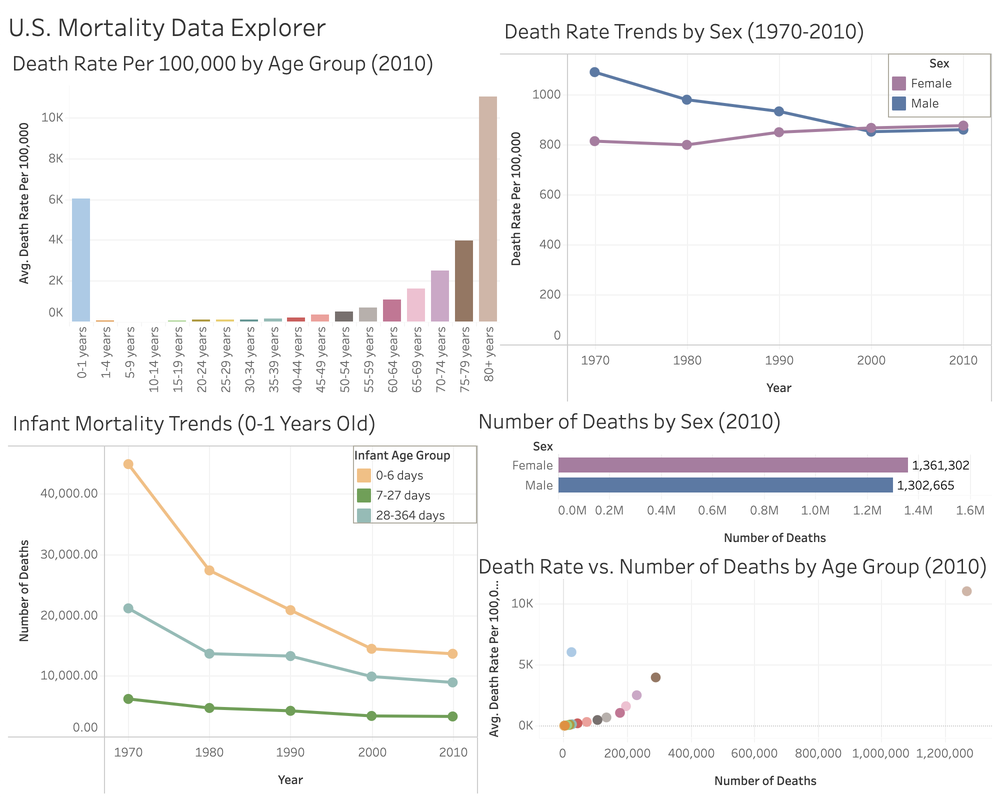

# us-mortality-data-explorer

This Tableau dashboard visualizes mortality data in the United States from 1970 to 2010, highlighting death rates and counts across age groups, sexes, and years to reveal demographic insights and long-term mortality trends.

### Data Source

Data comes from the [Global Burden of Disease Study 2010](https://ghdx.healthdata.org/record/ihme-data/gbd-2010-mortality-results-1970-2010) by the Institute for Health Metrics and Evaluation (IHME).

### View the Dashboard

Explore the interactive dashboard on Tableau Public:  
[U.S. Mortality Data Explorer](https://public.tableau.com/app/profile/gabrieljerho/viz/USMortalityDataExplorer/Dashboard)
